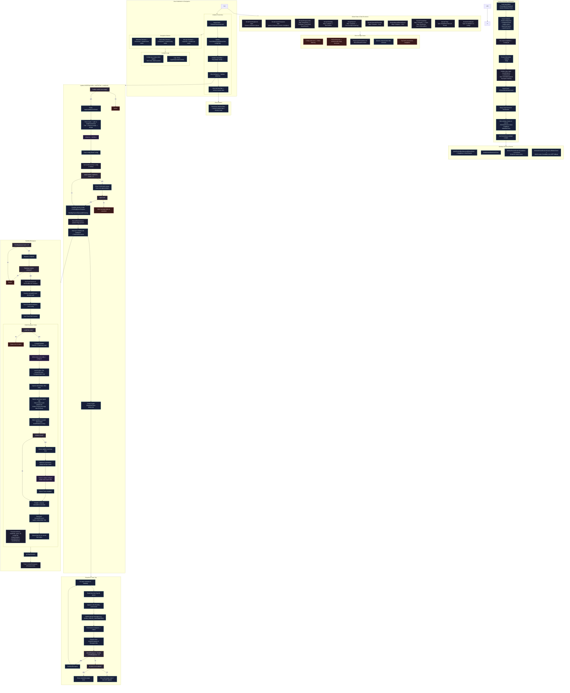

```mermaid
flowchart TD
  %% ================================
  %% MainWindow.ps1 High-Level Flow
  %% ================================

  %% Styles (optional)
  classDef section fill:#121133,stroke:#6a6cff,stroke-width:1px,color:#fff;
  classDef data fill:#1b1b2f,stroke:#8fc0ff,stroke-width:1px,color:#e6f0ff;
  classDef action fill:#18203a,stroke:#72e0d1,stroke-width:1px,color:#e6fffa;
  classDef io fill:#221a3b,stroke:#e48fff,stroke-width:1px,color:#ffe6ff;
  classDef warn fill:#3b1a1a,stroke:#ff8f8f,stroke-width:1px,color:#ffe6e6;
  classDef decision fill:#2a2438,stroke:#ffd166,stroke-width:1px,color:#fff;

  %% --------------------------------
  %% Startup & Window Initialization
  %% --------------------------------
  subgraph S["Startup & Window Initialization"]
    direction TB
    S1["Load assemblies</br>- PresentationFramework</br>- System.Windows.Forms"]:::action
    S2["Import modules</br>- Read-Config.psm1</br>- ConfigView.psm1</br>- Helpers.psm1</br>- ImportXaml.psm1</br>- LogsView.psm1"]:::action
    S3["Set script:configPath -> ..\\config.txt"]:::data
    S4["Ensure directories</br>- ..\\reports</br>- ..\\logs"]:::action
    S5["Initialize data maps</br>- brandPatterns</br>- LastSelected*</br>- Sync hashtables/queues</br>- Runspace tracking"]:::data
    S6["Import-Xaml ..\\Views\\MainWindow.xaml"]:::action
    S7["Merge Style Resource Dictionaries"]:::action
    S8["Wire window chrome & controls</br>- WindowChrome resize</br>- DragMove</br>- Min/Max/Close"]:::action
    S9["Set HomeView as default content"]:::action

    S1-->S2-->S3-->S4-->S5-->S6-->S7-->S8-->S9
  end

  %% ----------------------
  %% Global Data Structures
  %% ----------------------
  subgraph D["Global State & Data Structures"]
    direction TB
    D1["$script:PendingQueue</br>Type: System.Collections.Queue"]:::data
    D2["$script:ActiveRunspaces</br>Type: System.Collections.Generic.List[object]"]:::data
    D3["$script:RunspaceJobs</br>Map: PowerShell -> { Computer; PowerShell; AsyncResult }"]:::data
    D4["$script:TabsMap</br>Map: Computer -> RichTextBox"]:::data
    D5["$script:SyncUI</br>Map: Computer -> ConcurrentQueue[string]"]:::data
    D6["$script:QueuedOrRunning</br>Map: Computer -> bool"]:::data
    D7["$script:ManualRebootQueue</br>Map: Computer -> bool"]:::data
    D8["$script:PopupData</br>Map: Computer -> { Type; Data; SyncEvent; UserConfirmedRef }"]:::data
    D9["$script:Timer</br>Type: DispatcherTimer (UI thread)"]:::data
    D10["$script:throttleLimit</br>Type: int (default 5 or config)"]:::data
  end

  S10 --> D

  %% ------------------
  %% View Initialization
  %% ------------------
  subgraph V["View Initialization & Navigation"]
    direction TB

    subgraph VH["Initialize-HomeView"]
      direction TB
      VH1["Import-Xaml ..\\Views\\HomeView.xaml"]:::action
      VH2["Update-SearchButtonLabel(HomeView, configPath)"]:::action
      VH3["Initialize-SearchBar + Placeholder 'WSID...'"]:::action
      VH4["Wire btnSearch -> Update-WSIDFile"]:::action
      VH5["Wire btnClearTabs -> remove inactive tabs"]:::action
      VH1-->VH2-->VH3-->VH4-->VH5
    end

    subgraph VC["Config & Logs"]
      direction TB
      VC1["Config: lazy create & bind options</br>Wire Save, Option panels"]:::action
      VC2["Logs: Show-LogsView(contentControl)"]:::action
    end

    subgraph VN["Navigation Buttons"]
      direction TB
      VN1["btnHome.Checked -> HomeView + headerHome visible"]:::action
      VN2["btnConfig.Checked -> ConfigView + headerConfig visible"]:::action
      VN3["btnLogs.Checked -> LogsView + headerLogs visible"]:::action
    end

    S10-->VH
    VH-->VN
    VN-->VC
  end

  %% -----------------
  %% Update-WSIDFile()
  %% -----------------()
  %% -----------------
  subgraph U["Update-WSIDFile(textBox, wsidFilePath, configPath)"]
    direction TB
    U1["TextBox valid & non-empty?"]:::decision
    U2["Reset ApplyUpdatesConfirmed"]:::action
    U3["Parse inputs -> split on newlines/commas</br>Trim -> Remove empty -> Unique"]:::action
    U4["Write list -> WSID.txt"]:::io
    U5["Read config (Read-Config)"]:::action
    U6["Set throttleLimit from config or default"]:::data

    U7["applyUpdates enabled & count > 1?"]:::decision
    U8["Show Confirmation popup</br>Users can approve/abort"]:::action
    U9["Approved?"]:::decision
    U10["Populate queues & tabs</br>- PendingQueue.Enqueue</br>- TabsMap/SyncUI/QueuedOrRunning"]:::action
    U10a["ManualRebootQueue update if flags present"]:::data
    U11["Start up to throttleLimit runspaces</br>-> StartNextRunspace"]:::action
    U12["Create & start DispatcherTimer</br>100ms tick"]:::action

    U1 -- no --> Uend1["Return"]:::warn
    U1 -- yes --> U2-->U3-->U4-->U5-->U6-->U7
    U7 -- yes --> U8 --> U9
    U7 -- no  --> U10
    U9 -- no  --> Uend2["Abort; annotate tabs as cancelled"]:::warn
    U9 -- yes --> U10
    U10-->U10a-->U11-->U12
  end

  VH4 --> U

  %% -------------------
  %% StartNextRunspace {}
  %% -------------------
  subgraph R["StartNextRunspace"]
    direction TB
    R0["PendingQueue.Count > 0?"]:::decision
    R1["Dequeue computer"]:::action
    R2["TabsMap contains computer?"]:::decision
    R3["Get SyncUI queue & RichTextBox for computer"]:::data
    R4["Resolve remoteDCU.ps1 absolute path"]:::action
    R5["Read EnabledCmdOption from config"]:::action
    R6["New PowerShell instance"]:::action

    %% The added script (two phases) runs in the child runspace
    subgraph RPH["Child Runspace Script"]
      direction TB
      RPH1["Param(hostName, scriptPath, queue, tb, configPath, isApplyUpdates, popupDataSync, brandPatterns)"]:::data
      RPH2["scriptPath exists?"]:::decision
      RPH3["If isApplyUpdates</br>PHASE 1: Preliminary scan"]:::action
      RPH3a["Write temp scan config -> config.txt"]:::io
      RPH3b["Launch pwsh -File remoteDCU.ps1 -ComputerName host"]:::action
      RPH3c["Capture stdout/stderr; filter noise"]:::action
      RPH3d["Wait for and parse report XML</br>Select nodes; build updates list</br>Collect remote driver/app data (PsExec)"]:::action
      RPH3e["Match updates vs system drivers/apps</br>brandPatterns scoring"]:::action
      RPH3f["Updates found?"]:::decision
      RPH3g["Queue updates summary lines"]:::action
      RPH3h["Optional Confirmation popup via Sync event"]:::action
      RPH3i["Restore original config.txt</br>Delete temp report XML"]:::io
      RPH3x["Queue 'Scan complete!'"]:::action

      RPH4["PHASE 2: Normal remoteDCU execution"]:::action
      RPH4a["Start pwsh (remoteDCU.ps1)</br>capture stdout/stderr fully"]:::action
      RPH4b["Queue lines for UI; record final status"]:::action

      RPH2 -- no --> RPHend["Queue error & return"]:::warn
      RPH2 -- yes --> RPH3 --> RPH3a --> RPH3b --> RPH3c --> RPH3d --> RPH3e --> RPH3f
      RPH3f -- no --> RPH4
      RPH3f -- yes --> RPH3g --> RPH3h --> RPH3i --> RPH3x --> RPH4
      RPH4 --> RPH4a --> RPH4b
    end

    R7["ps.BeginInvoke()"]:::action
    R8["Track in ActiveRunspaces & RunspaceJobs"]:::data

    R0 -- no --> Rend["Return"]:::warn
    R0 -- yes --> R1 --> R2
    R2 -- no --> Rend
    R2 -- yes --> R3 --> R4 --> R5 --> R6 --> RPH --> R7 --> R8
  end

  U11 --> R

  %% -----------------
  %% Dispatcher Timer
  %% -----------------
  subgraph T["Dispatcher Timer Tick"]
    direction TB
    T1["For each computer in TabsMap"]:::action
    T2["Read lines from SyncUI queue"]:::action
    T3["Append to RichTextBox; scroll to end"]:::action
    T4["Handle special messages (e.g., SHOW_UPDATE_CONFIRMATION)"]:::action

    T5["Find finished runspaces -> collect"]:::action
    T6["Remove from ActiveRunspaces & RunspaceJobs"]:::action
    T7["ActiveRunspaces < throttle & PendingQueue > 0?"]:::decision
    T8["StartNextRunspace"]:::action

    T9["All done & not notified?"]:::decision
    T10["Show completion popup once"]:::action
    T11["Else reset popup state if new work appears"]:::action

    T1-->T2-->T3-->T4-->T5-->T6-->T7
    T7 -- yes --> T8 --> T1
    T7 -- no  --> T9
    T9 -- yes --> T10
    T9 -- no  --> T11
  end

  U12 --> T

  %% -----------------
  %% Clear Buttons
  %% -----------------
  subgraph C["Clear Buttons"]
    direction TB
    C1["HomeView: btnClearTabs -> remove inactive tabs + cleanup maps"]:::action
  end

  %% ----------------------
  %% Window Chrome & Resize
  %% ----------------------
  subgraph W["Window Chrome & Resize"]
    direction TB
    W1["panelControlBar.MouseLeftButtonDown -> DragMove or Max/Restore"]:::action
    W2["btnMinimize/Maximize/Close"]:::action
    W3["WindowResizeBorder.MouseMove -> set cursors</br>hit-test for resize zones"]:::action
    W4["WindowResizeBorder.MouseLeftButtonDown -></br>Win32 resize if available; else WPF fallback"]:::action
  end

  %% Wiring
  S9-->W
  VB3-->B
  VH5-->C

  %% ------------------
  %% Error/Edge Handling
  %% ------------------
  subgraph E["Error & Edge Cases"]
    direction TB
    E1["Config read errors -> Write-Warning"]:::warn
    E2["PsExec/timeouts -> continue with empty structures"]:::warn
    E3["Popup synchronization via ManualResetEventSlim"]:::data
    E4["Queues cleaned when tabs removed"]:::action
    E5["Try/Catch around IO & navigation"]:::warn
  end

  D-->E
```

