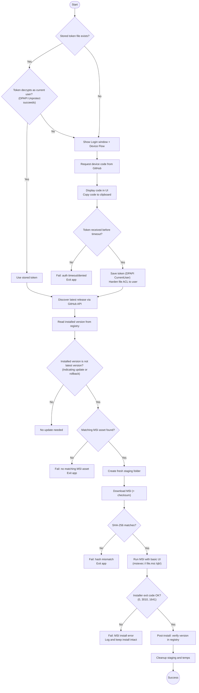

```mermaid
flowchart TD
  A([Start]) --> B{"Stored token file exists?"}
  B -- Yes --> B1{"Token decrypts as current user? </br> (DPAPI Unprotect succeeds)"}
  B -- No --> D["Show Login window + Device Flow"]
  B1 -- Yes --> C["Use stored token"]
  B1 -- No --> D
  D --> E["Request device code from GitHub"]
  E --> F["Display code in UI </br> Copy code to clipboard"]
  F --> G{"Token received before timeout?"}
  G -- No --> X1["Fail: auth timeout/denied </br> Exit app"]
  G -- Yes --> H["Save token (DPAPI CurrentUser) </br> Harden file ACL to user"]
  C --> I["Discover latest release via GitHub API"]
  H --> I
  I --> V1["Read installed version from registry"]
  V1 --> V2{"Installed version is not latest version? </br> (Indicating update or rollback)"}
  V2 -- No --> X0["No update needed"]
  V2 -- Yes --> J{"Matching MSI asset found?"}
  J -- No --> X2["Fail: no matching MSI asset </br> Exit app"]
  J -- Yes --> K["Create fresh staging folder"]
  K --> L["Download MSI (+ checksum)"]
  L --> M{"SHA-256 matches?"}
  M -- No --> X3["Fail: hash mismatch </br> Exit app"]
  M -- Yes --> N["Run MSI with basic UI </br> (msiexec /i file.msi /qb!)"]
  N --> S{"Installer exit code OK? </br> (0, 3010, 1641)"}
  S -- No --> X4["Fail: MSI install error </br> Log and keep install intact"]
  S -- Yes --> T["Post-install: verify version in registry"]
  T --> U["Cleanup staging and temps"]
  U --> V((Success))
```
