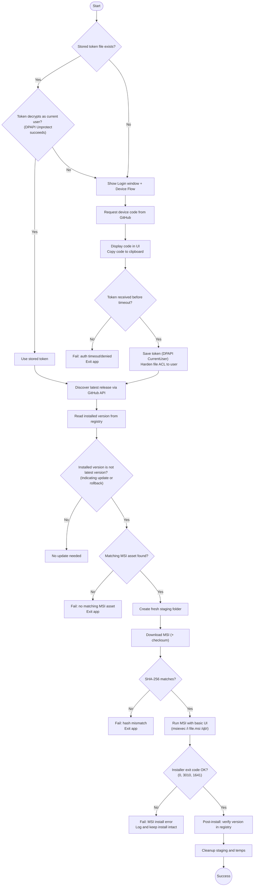

# DONUT Diagrams

PlantUML (`.puml`) sources for DONUT's structure and runtime flows, the visual
companion to the [architecture pages](../development/architecture/overview.md).

> **Rendering.** GitHub does not render `.puml` inline without a plugin — but the
> **docs site renders every diagram as SVG**: each structure diagram is embedded
> on its [architecture subsystem page](../development/architecture/overview.md),
> and the flows are on
> [Runtime flows](https://danial-changez.github.io/DONUT/development/architecture/runtime-flows/).
> To preview locally, use the [PlantUML VS Code extension](https://marketplace.visualstudio.com/items?itemName=jebbs.plantuml)
> or run `tools\Render-Diagrams.ps1`. `network-flow.png` is a committed render
> (the site's SVG is canonical if the two ever differ), and the self-update flow
> is inlined as [mermaid](#self-update-flow) below (which GitHub does render).
> Keep each file's `@startuml <name>` equal to its filename — it names the
> rendered SVG.

## Structure

One class diagram per subsystem (the old all-in-one `class_diagram.puml` was
retired in favor of these):

| Diagram | Shows |
|---------|-------|
| [`component_diagram.puml`](component_diagram.puml) | Component wiring: launcher → scripts → presenters → services → workers |
| [`class_runspaces.puml`](class_runspaces.puml) | Job pool + worker process isolation (`AsyncJob`, `WorkerProcess`, `RunspaceManager`) |
| [`class_remote_exec.puml`](class_remote_exec.puml) | PsExec transport, DCU job services, inventory/storage models |
| [`class_lens.puml`](class_lens.puml) | AD search/account actions + the User Lens DTOs |
| [`class_ui.puml`](class_ui.puml) | Presenters, view-models, C# MVVM/interop bases, UI mapper models |
| [`class_config.puml`](class_config.puml) | Configuration, persistence, logging, startup task, self-update |

## Runtime flows

| Diagram | Shows |
|---------|-------|
| [`scan_sequence_diagram.puml`](scan_sequence_diagram.puml) | Scan a machine (async, non-blocking) |
| [`applyUpdates_sequence_diagram.puml`](applyUpdates_sequence_diagram.puml) | Apply updates (24h scan reuse + per-host confirm) |
| [`activity_diagram.puml`](activity_diagram.puml) | Remote worker flow inside a pool runspace (`ExecutionService`) |
| [`inventory_sequence_diagram.puml`](inventory_sequence_diagram.puml) | Machine detail: inventory prefetch + WizTree storage scan |
| [`ad_finder_sequence_diagram.puml`](ad_finder_sequence_diagram.puml) | Home search bar: live multi-forest AD finder + inline unlock |
| [`lens_lookup_sequence_diagram.puml`](lens_lookup_sequence_diagram.puml) | User Lens via the persistent de-elevated agent (pick a person → devices) |
| [`network-flow.puml`](network-flow.puml) ([png](network-flow.png)) | Remote operation network routing: resolve → reconnect → update → settle (code-grounded trace) |
| [`update_sequence_diagram.puml`](update_sequence_diagram.puml) | Self-update: GitHub device flow + MSI (detailed source for the flow below) |

## Self-update flow

The one flow inlined here because it renders on GitHub; `update_sequence_diagram.puml`
is the detailed participant-level source.

